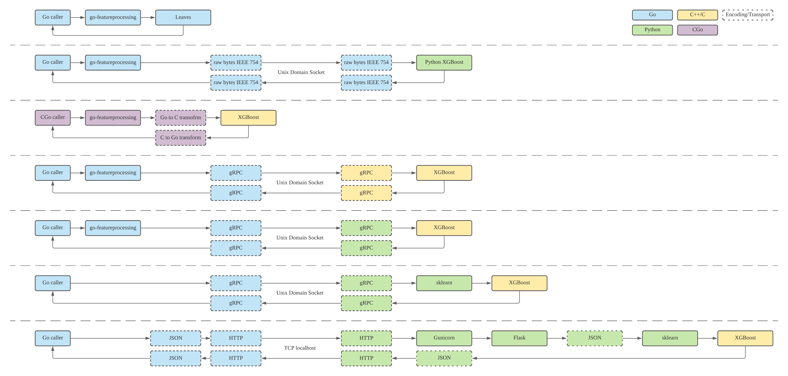
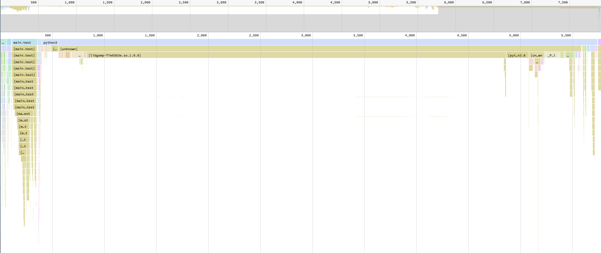
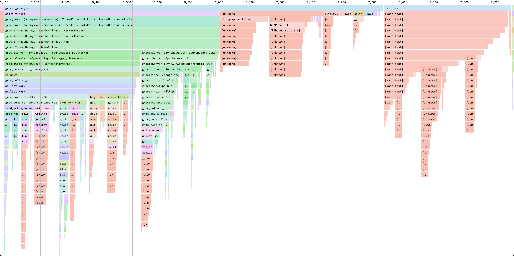

# Go Machine Learning Benchmarks

> Given a raw data in a Go service, how quickly can I get machine learning inference for it?

Typically, Go is dealing with structured single sample data.
Thus, we are focusing on tabular machine learning models only, such as popular [XGBoost](https://github.com/dmlc/xgboost).
It is common to run Go service in a backed form and on Linux platform, thus we do not consider other deployment options.
In the work bellow, we compare typical implementations on how this inference task can be achieved.



```
host: AWS EC2 t2.xlarge shared
os: Ubuntu 20.04 LTS 
goos: linux
goarch: amd64
cpu: Intel(R) Xeon(R) CPU E5-2686 v4 @ 2.30GHz
BenchmarkXGB_Go_GoFeatureProcessing_GoLeaves_noalloc           24587670           491 ns/op
BenchmarkXGB_Go_GoFeatureProcessing_GoLeaves                   20823667           575 ns/op
BenchmarkXGB_Go_GoFeatureProcessing_UDS_RawBytes_Python_XGB       46656        243056 ns/op
BenchmarkXGB_CGo_GoFeatureProcessing_XGB                          72337        244941 ns/op
BenchmarkXGB_Go_GoFeatureProcessing_UDS_gRPC_CPP_XGB              32714        367433 ns/op
BenchmarkXGB_Go_GoFeatureProcessing_UDS_gRPC_Python_XGB           15352        785147 ns/op
BenchmarkXGB_Go_UDS_gRPC_Python_sklearn_XGB                         546      21699830 ns/op
BenchmarkXGB_Go_HTTP_JSON_Python_Gunicorn_Flask_sklearn_XGB         546      21935237 ns/op
```

### Abbreviations and Frameworks

- Transport: Unix Domain Sockets (UDS), TCP, HTTP
- Encoding: JSON, [gRPC](https://grpc.io/), raw bytes with fixed number of float64 IEEE 754
- Preprocessing: [go-featureprocessing](https://github.com/nikolaydubina/go-featureprocessing), [sklearn](https://scikit-learn.org/stable/modules/classes.html#module-sklearn.preprocessing)
- Model: [XGBoost](https://github.com/dmlc/xgboost), [Leaves](https://github.com/dmitryikh/leaves) (Leaves is XGBoost in native Go)
- Web Servers: for Python used [Gunicorn](https://gunicorn.org/) + [Flask](https://flask.palletsprojects.com/en/1.1.x/)

### Dataset and Model

We are using classic [Titanic dataset](https://www.kaggle.com/c/titanic).
It contains numerical and categorical features, which makes it a representative of typical case.
Data and notebooks to train model and preprocessor is available in /data and /notebooks.

### Some numbers for reference

How fast do you need to get?

```
                   200ps - 4.6GHz single cycle time
                1ns      - L1 cache latency
               10ns      - L2/L3 cache SRAM latency
               20ns      - DDR4 CAS, first byte from memory latency
               20ns      - C++ raw hardcoded structs access
               80ns      - C++ FlatBuffers decode/traverse/dealloc
              150ns      - PCIe bus latency
              171ns      - cgo call boundary, 2015
              200ns      - HFT FPGA
              475ns      - 2020 MLPerf winner recommendation inference time per sample
 ---------->  500ns      - go-featureprocessing + leaves
              800ns      - Go Protocol Buffers Marshal
              837ns      - Go json-iterator/go json unmarshal
           1µs           - Go protocol buffers unmarshal
           3µs           - Go JSON Marshal
           7µs           - Go JSON Unmarshal
          10µs           - PCIe/NVLink startup time
          17µs           - Python JSON encode/decode times
          30µs           - UNIX domain socket; eventfd; fifo pipes
         100µs           - Redis intrinsic latency; KDB+; HFT direct market access
         200µs           - 1GB/s network air latency; Go garbage collector pauses interval 2018
         230µs           - San Francisco to San Jose at speed of light
         500µs           - NGINX/Kong added latency
     10ms                - AWS DynamoDB; WIFI6 "air" latency
     15ms                - AWS Sagemaker latency; "Flash Boys" 300million USD HFT drama
     30ms                - 5G "air" latency
     36ms                - San Francisco to Hong-Kong at speed of light
    100ms                - typical roundtrip from mobile to backend
    200ms                - AWS RDS MySQL/PostgreSQL; AWS Aurora
 10s                     - AWS Cloudfront 1MB transfer time
```

### Profiling and Analysis

**[491ns/575ns]** Leaves — we see that most of time taken in Leaves Random Forest code. Leaves code does not have mallocs. Inplace preprocessing does not have mallocs, with non-inplace version malloc happen and takes and takes half of time of preprocessing.


**[243µ]** UDS Raw bytes Python — we see that Python takes much longer time than preprocessing in Go, however Go is at least visible on the chart. We also note that Python spends most of the time in `libgomp.so` call, this library is in GNU OpenMP written in C which does parallel operations.



**[244µ]** CGo version — similarly, we see that call to `libgomp.so` is being done. It is much smaller compare to rest of o CGo code, as compared to Python version above. Over overall results are not better then? Likely this is due to performance degradation from Go to CGo. We also note that malloc is done.


**[367µ]** gRPC over UDS to C++ — we see that Go code is around 50% of C++ version. In C++ 50% of time spend on gRPC code.
Lastly, C++ also uses `libgomp.so`. We don't see on this chart, but likely Go code also spends considerable time on gRPC code.



**[785µ]** gRPC over UDS to Python wihout sklearn — we see that Go code is visible in the chart. Python spends only portion on time in `libgomp.so`.


**[21ms]** gRPC over UDS to Python with sklearn — we see that Go code (`main.test`) is no longer visible the chart. Python spends only small fraction of time on `libgomp.so`.


**[22ms]** REST service version with sklearn — similarly, we see that Go code (`main.test`) is no longer visible in the chart. Python spends more time in `libgomp.so` as compared to Python + gRPC + skelarn version, however it is not clear why results are worser.


### Future work

- [ ] go-featureprocessing - gRPCFlatBuffers - C++ - XGB
- [ ] batch mode
- [ ] UDS - gRPC - C++ - ONNX (sklearn + XGBoost)
- [ ] UDS - gRPC - Python - ONNX (sklearn + XGBoost)
- [ ] cgo ONNX (sklearn + XGBoost) (examples: [1](http://onnx.ai/sklearn-onnx/auto_examples/plot_pipeline_xgboost.html))
- [ ] native Go ONNX (sklearn + XGBoost) — no official support, https://github.com/owulveryck/onnx-go is not complete
- [ ] text
- [ ] images
- [ ] videos

### Reference

- [Go GC updates, 2018](https://blog.golang.org/ismmkeynote)
- [cgo performance, GopherCon'18](https://about.sourcegraph.com/go/gophercon-2018-adventures-in-cgo-performance/)
- [cgo performance, CockroachDB](https://www.cockroachlabs.com/blog/the-cost-and-complexity-of-cgo/)
- [cgo call to CPython, Datadog](https://www.datadoghq.com/blog/engineering/cgo-and-python/)
- [cgo call to CPython, EuroPython'19](https://ep2019.europython.eu/talks/Zktoaai-golang-to-python/)
- [HFT latency](https://en.wikipedia.org/wiki/Ultra-low_latency_direct_market_access)
- [HFT FPGA latency](https://ieeexplore.ieee.org/document/6299067)
- [HFT FPGA 200 nanoseconds, 2018](https://apnews.com/press-release/pr-businesswire/2edb1f8f12d64ab490ef0c180e648e24)
- [Google TPU latency](https://ai.googleblog.com/2019/08/efficientnet-edgetpu-creating.html)
- [PCIe latency](https://www.cl.cam.ac.uk/research/srg/netos/projects/pcie-bench/neugebauer2018understanding.pdf)
- "Evaluating Modern GPU Interconnect: PCIe, NVLink, NV-SLI, NVSwitch and GPUDirect", 2019
- ["Evaluation of Inter-Process Communication Mechanisms"](http://pages.cs.wisc.edu/~adityav/Evaluation_of_Inter_Process_Communication_Mechanisms.pdf)
- [UNIX local IPC latencies](http://kamalmarhubi.com/blog/2015/06/10/some-early-linux-ipc-latency-data/)
- [Cache and DRAM latency](https://en.wikipedia.org/wiki/CPU_cache)
- [MLPerf benchmarks](https://github.com/mlcommons/inference)
- [MLPerf benchmarks results, 2020](https://mlperf.org/inference-results-0-7)
- [Redis latency](https://redis.io/topics/latency)
- [Huawei WIFI6 latency](https://e.huawei.com/sg/products/enterprise-networking/wlan/wifi-6)
- [Verizon 5G latency](https://www.verizon.com/about/our-company/5g/5g-latency)
- [NGINX added latency](https://www.nginx.com/blog/nginx-controller-api-management-module-vs-kong-performance-comparison/)
- [AWS Sagemaker latency](https://aws.amazon.com/blogs/machine-learning/load-test-and-optimize-an-amazon-sagemaker-endpoint-using-automatic-scaling/)
- [AWS Aurora latency](https://aws.amazon.com/blogs/database/using-aurora-to-drive-3x-latency-improvement-for-end-users/)
- [AWS Cloudfront transfer rates](https://media.amazonwebservices.com/FS_WP_AWS_CDN_CloudFront.pdf)
